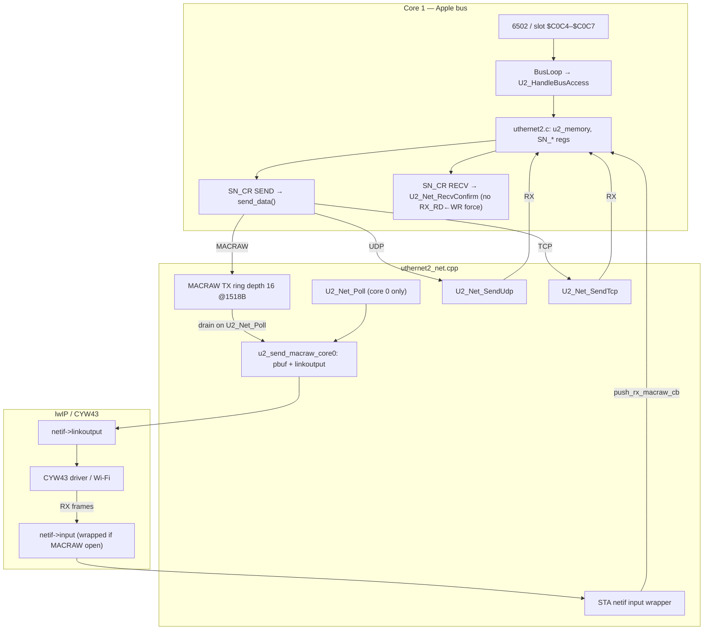
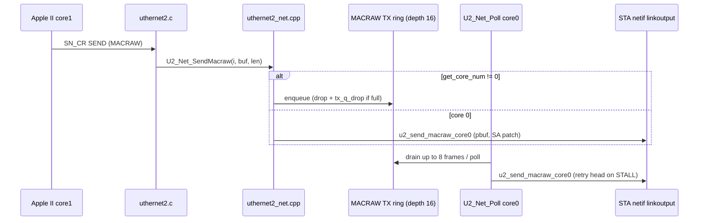
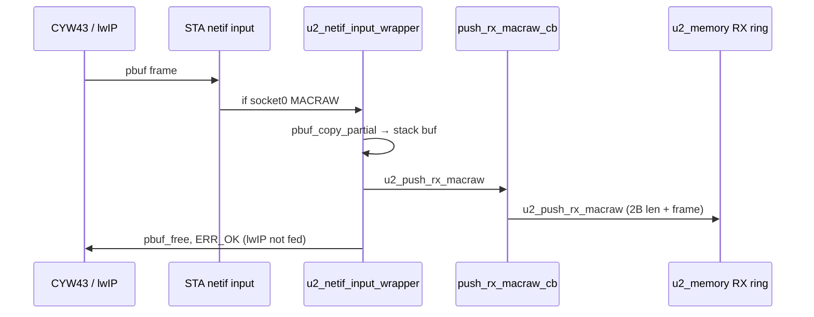
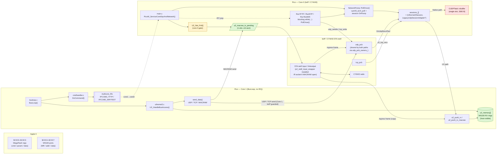

# Uthernet II stack — architecture review, contracts, and open work

This document supplements `docs/Implementation-notes-and-reasoning.md` (§1j–§1ak, §1az) with a consolidated **data-path view**, **diagrams**, **function contracts**, and a **prioritized TODO list** with **validation checklists**. Primary sources: `pico/uthernet2.c`, `pico/uthernet2_net.cpp`, `pico/network_pump.{h,cpp}`, `pico/main.c`, `pico/busloop.c`, `pico/u2_monitor.c`.

---

## Latest updates

**2026-06-27 (§10z):** P0-2 MACRAW TX **ring** (depth 16), honest **`Sn_TX_RD`**, **`[u2macraw]`** telemetry.

**2026-06-27 (§10k / §10w / §10x):** MACRAW/lwIP ingress split, **`U2_Net_ServicePoll`** from **`PollOnce`**, core-0 poll-before-FIFO — see **§2.5**. **P0-2** MACRAW TX ring — §**10z**.

**2026-05 (§1az):** Inbound buffer parity and follow-up fixes (details in **§1az** and §**1az** follow-up in `Implementation-notes-and-reasoning.md`):

| Topic | Behavior |
|-------|----------|
| **MACRAW RX when full (default)** | **Strict W5100:** if `free_rx < 2 + frame_len`, **drop the incoming frame** only — do not advance host `Sn_RX_RD` to make room. |
| **MACRAW compat (optional)** | CMake / `-D` **`U2_MACRAW_COMPAT_DROP_OLDEST`**: when **`1`**, call **`u2_socket_discard_rx()`** once (set **`Sn_RX_RD` → `sn_rx_wr`**) then retry admission — helps DHCP/ARP bursts; **not** datasheet-accurate. Wired through **`build-debug-both.sh`** env; default **`0`**. |
| **`sn_rx_wr` + `RMSR` writes** | On **`RMSR`** remap, **`sn_rx_wr`** is **`old_wr % new_receive_size`** (not zeroed). Zeroing on every host **`RMSR`** write had desynchronized RX vs **`Sn_RX_RD`** and made **egress look broken** (TCP/ACK stalls). |
| **`sn_rx_wr` visibility** | Producer publishes with **`__atomic_store_n(..., __ATOMIC_RELEASE)`** after ring writes; **`get_rx_rsr`** loads with **`__ATOMIC_ACQUIRE`**. |
| **`Sn_TX_FSR` / TX sizing** | **`get_tx_data_size` / `get_tx_fsr_byte`** return safe values when **`transmit_size == 0`** (TMSR clamp), avoiding bogus **`mask`** math. |
| **RX drop telemetry** | **`U2_MonNetRxDrop`** in **`u2_monitor.c`**: rate-limited (**~100 ms** per socket + reason) to reduce UART contention under floods. |
| **Sizing helper** | **`u2_apply_socket_sizes()`** applies **`TMSR`/`RMSR`** consistently; RX clamp to 8 KiB window emits **`size-map-clamped`** telemetry when relevant. |

---

## 1. Layered architecture (summary)

| Layer | Responsibility | Key symbols |
|-------|----------------|-------------|
| Apple II bus | Slot decode, PIO chunk updates | `busloop.c` → `U2_HandleBusAccess` |
| W5100 emulation | Registers, TX/RX rings in `u2_memory`, commands | `uthernet2.c` |
| Net bridge | lwIP UDP/TCP/MACRAW, STA netif, queues | `uthernet2_net.cpp` |
| Pump | Shared CYW43 poll, sessions, abort | `network_pump.cpp`, `main.c` |
| Radio | CYW43 STA `linkoutput` / ingress `input` | lwIP + `cyw43_state.netif[STA]` |

---

## 2. Detailed data-flow diagram

### 2.1 End-to-end (MACRAW-centric, ADTPro / ip65)



### 2.2 MACRAW TX path (core split)



### 2.3 MACRAW RX path (ingress ownership)



### 2.5 Firmware changes since §10l (`7adb4ee`) — §10k / §10w / §10x

| Area | What changed | Why |
|------|----------------|-----|
| **Ingress** (`u2_netif_input_wrapper`) | If **`IsLegacyOperationActive()`** → lwIP only. If sock0 **MACRAW** and not legacy → MACRAW ring only, **`pbuf_free`**, no lwIP. | lwIP **RST** on ip65 SYN-ACK (duplicate **`netif->input`**) — §**10w**. |
| **MACRAW TX drain** | **`U2_Net_ServicePoll()`** from **`PollOnce()`** first; **`U2_Net_Poll()`** → **`PollOnce()`** only. | Drain MACRAW TX during native **`RunX`** without ingress competition — §**10m**. |
| **Core 0 poll** (`main.c`) | Poll **before** FIFO; **`core0Loop`** FIFO **0** (was **50 ms**). | Tens of ms lwIP starvation when FIFO blocked first — §**10x**. |
| **Core 1 wake** | **`IPCCMD_NET_WAKE`** + **`U2_RequestCore0NetPoll`** on **`U2_Poll`** (1/ms) and **`SN_CR_SEND`/`RECV`**. | Faster service during ip65 storms — §**10k** / §**10x**. |
| **Still open (P0-2)** | ~~1-slot MACRAW TX trampoline; unconditional **`TX_RD`** advance.~~ **Fixed §10z:** ring depth **16** (RP2350), honest **`TX_RD`**, **`[u2macraw]`** counters. | **CYW43 STALL** + stuck ACK — §**10y** / §**10z**. |

**Validation (2026-06-27):** Local telnet SYN-ACK→ACK **~43 ms**; **~71 s** session; **wacbbs** several screens. See **`debug/megaflash.pcap`** + UART log.

### 2.4 Coexistence view (MegaFlash native + Uthernet II on one lwIP)

One-page view of how the **MegaFlash native** stack (NTP / TFTP / TestWifi) and
the **Uthernet II** emulator share one lwIP / CYW43 instance. See §8 for the
primary/secondary policy discussion. Green = obeys the "drop only at the door"
rule; red = does not; yellow = core-affinity-gated path that can stall during a
native operation.



ASCII fallback (same intent, plain text):

```
                ┌──────────────────────── Apple II ────────────────────────┐
                │  $C0C0–$C0C3  MegaFlash regs    $C0C4–$C0C7  W5100 ports │
                └────────┬─────────────────────────────┬───────────────────┘
                         │                             │
        ───────  CORE 1  │   (BusLoop, no IRQ)         │  ───────────────
                         ▼                             ▼
                cmdhandler.c                     uthernet2.c
                DoCommand()                      U2_HandleBusAccess()
                     │                                 │
                     │ IPCCMD_TFTP /                   ├── send_data() ── UDP/TCP ──┐
                     │ IPCCMD_WIFITEST                 │                            │
                     │ via multicore_fifo              ├── send_data() ── MACRAW ─► [u2_macraw_tx_pending] (1-slot)
                     │                                 │
                     │                                 └── u2_push_rx*  ◄── (writes RX ring)
                     ▼                                                          ▲
        ──────────────────────────  CORE 0  ────────────────────────────────────│────
            main.c  PicoW_ServiceCore0IpcAndNetwork()                           │
                ├─ U2_Net_Poll()  ──── drain trampoline (core-0 gated) ◄────────┘
                ├─ NetworkPump::PollOnce()
                │       │      cyw43_arch_poll + for s in sessions_: s->OnPump
                │       │      sessions_ = { Uthernet2Session,  LegacyUdpSessionAdapter? }
                │       │              ▲                                ▲
                │       │              │ OnUdpRecvPbuf                  │ OnUdpRecvPbuf
                │       │              │  → u2_push_rx (UDP/TCP)        │  → CUDPTask::rxbuffer (1 slot, may overwrite)
                └─ pops IPC ─► RunTFTP / RunNTP / RunTestWifi
                                  │
                                  └── while(!completed) PollOnce();   (blocks Core 0)
                                                                       (U2 socket RX still fires;
                                                                        U2 MACRAW TX trampoline STALLS
                                                                        because U2_Net_Poll isn't called
                                                                        from this inner loop)
        ─────────────────────────  lwIP / CYW43  ─────────────────────────────────
            udp_pcb / tcp_pcb  (shared via udp_pcb_owners_ / tcp_pcb_owners_)
            STA netif:
              input          ─►  if sock-0 MACRAW open: u2_netif_input_wrapper
                                  ├── copy to W5100 RX ring (u2_push_rx_macraw)
                                  └── pass to lwIP saved input  (so DHCP/ARP keep working)
              linkoutput     ◄── u2_send_macraw_core0 (pbuf + SA patch)
            CYW43 driver / Wi-Fi
        ──────────────────────────────────────────────────────────────────────────
```

Key reads from the diagram:

- **lwIP edge is already shared** (`sessions_[]`, `udp_pcb_owners_`,
  `tcp_pcb_owners_`). It is the natural unification layer; the W5100 RX ring
  is **not** (it carries wire-format framing the native protocols neither
  produce nor consume).
- **MegaFlash native is a blocking session**, **U2 is an always-on session**.
  They co-poll via one `PollOnce`.
- The **green** boxes already obey "drop only when full." The **red** box
  (`CUDPTask::rxbuffer`) does not. The **yellow** box (`U2_Net_Poll` core-0
  gate) explains the MACRAW-TX stall while a native op runs.

---

## 3. Buffer and queue inventory

| Name | Location | Size / shape | Role |
|------|----------|--------------|------|
| `u2_memory` | `uthernet2.c` | `W5100_MEM_SIZE` (0x8000) | Emulated W5100 RAM: common regs, socket regs, TX/RX windows |
| Socket TX/RX windows | inside `u2_memory` | From `TMSR`/`RMSR` via `u2_apply_socket_sizes()` | Host-visible rings; `transmit_base`/`receive_base` per socket; **`RMSR`** remap remaps **`sn_rx_wr`** modulo new size (does not zero) |
| `Sn_RX_RD` | `u2_memory` socket regs | Host-written consume pointer | Consumer for **`RX_RSR`**; updated by Apple stack before/around **`RECV`** |
| `sn_rx_wr` | `u2_socket_t` | Ring offset; **`__atomic`** release/acquire vs **`get_rx_rsr`** | Producer for inbound UDP/TCP/MACRAW; **not** a host register |
| MACRAW TX ring | `uthernet2_net.cpp` | **16×1518 B** queue (depth **4** on RP2040); `tx_q_drop` / `lo_err` / `pbuf_fail` counters; drain **8**/poll — §**10z** | Core1 enqueue; core0 **`u2_send_macraw_core0`**; **`Sn_TX_RD`** advances only on accept |
| lwIP `pbuf` | lwIP heap | Per TX/RX op | MACRAW TX alloc `PBUF_RAW`; UDP `PBUF_TRANSPORT` |
| UDP/TCP RX temp | `uthernet2_net.cpp` | `std::vector` copy of payload | Bridge lwIP → `u2_push_rx` |
| MACRAW RX temp | `u2_netif_input_wrapper` | Stack `buf[1518]` | Copy frame before push to W5100 RX |
| `u2_monitor` ring | `u2_monitor.c` | 256 events, flush ≤128/call | Debug trace; pointer dedup in `U2_MonSockPtrs`; **`U2_MonNetRxDrop`** throttled per sock/reason (~100 ms) |

---

## 4. Function contract table

Contracts describe **intended** behavior as implemented today; rows marked **gap** note mismatches with robust “ideal” semantics.

### 4.1 Bus / emulation (`pico/uthernet2.c`)

| Symbol | Callable from | Preconditions | Effects | Failure / gap |
|--------|----------------|---------------|---------|----------------|
| `U2_HandleBusAccess` | Core 1 (bus loop) | Valid `busdata` decode | Read/write MR/addr/data path; may trigger `send_data`, socket ops | Long paths block bus (timing-sensitive) |
| `send_data` | Core 1 via `SN_CR SEND` | Socket mode matches status | Copies TX ring → `U2_Net_*`; MACRAW: **`TX_RD`** only if send accepted (§**10z**) | UDP/TCP still advance **`TX_RD`** unconditionally |
| `u2_push_rx` | Core 0 (lwIP callback → cb) | Socket valid | Writes UDP header + payload or TCP payload into RX ring; **one release store of `sn_rx_wr` per enqueue** (P0-3) | Partial TCP accept; UDP atomic or drop; **`U2_MonNetRxDrop`** on no-room/partial |
| `u2_push_rx_macraw` | Core 0 via cb | Space for `2+len` | Prepends 2B wire length + frame; **strict:** drop incoming if full; **`U2_MACRAW_COMPAT_DROP_OLDEST`:** optional **`u2_socket_discard_rx`** then retry | Oversize frame dropped; compat path mutates **`Sn_RX_RD`** (non-W5100) |
| `set_rx_sizes` / `u2_apply_socket_sizes` | Core 1 (`W5100_RMSR` write) | Valid chip layout | Updates **`receive_base`/`receive_size`**; **remaps `sn_rx_wr`** | Clamp telemetry if map overflows 8 KiB RX window |
| `write_socket_register` … `RECV` | Core 1 | Host updated `Sn_RX_RD` | **`U2_Net_RecvConfirm`** only — **does not** set **`RX_RD ← sn_rx_wr`** | `RecvConfirm` no-op in net layer |

### 4.2 Net bridge (`pico/uthernet2_net.cpp`)

| Symbol | Callable from | Preconditions | Effects | Failure / gap |
|--------|----------------|---------------|---------|----------------|
| `U2_Net_Init` | Core 0 (`U2_Init`) | CYW43 path compiled in | Registers callbacks; MACRAW ring reset; `AddSession(Uthernet2Session)` | — |
| `U2_Net_OpenMacraw` | Core 1 via OPEN | `i` valid | Sets PCB_MACRAW; wraps STA `input` if socket 0 | Only socket 0 installs wrapper |
| `U2_Net_SendMacraw` | Core 0 or 1 | MACRAW open, len ≤ 1518 | Core1: ring enqueue (**`tx_q_drop`** if full); Core0: **`u2_send_macraw_core0`**. Returns **0** / **-1** | — |
| `U2_Net_ServicePoll` | Core 0 (`PollOnce` first) | — | Drain ring (≤8); **`[u2macraw]`** stats (10 s) | Stops drain on **`linkoutput`** fail (retry next poll) |
| `U2_Net_Poll` | Core 0 only | — | `NetworkPump_PollOnce()` (includes **`U2_Net_ServicePoll`**) | Returns immediately on core ≠ 0 |
| `u2_netif_input_wrapper` | lwIP (core 0) | §**10w** gate | Legacy op → lwIP only; MACRAW sock0 → ring only; else lwIP | — |
| `u2_send_macraw_core0` | Core 0 | Initialized STA netif | pbuf + SA patch + **`linkoutput`**; returns **`bool`** | **`lo_err`** / **`pbuf_fail`** counters |
| `U2_Net_SendUdp` | Core 1 via `send_data` | UDP pcb bound | `udp_sendto`; counts stats | Returns void; no backpressure to W5100 |
| `U2_Net_SendTcp` | Core 1 | TCP pcb | `tcp_write` + `tcp_output` | Same |

### 4.3 Pump / lifecycle (`pico/network_pump.cpp`, `pico/main.c`)

| Symbol | Callable from | Preconditions | Effects | Failure / gap |
|--------|----------------|---------------|---------|----------------|
| `NetworkPump_PollOnce` | Core 0 | — | `cyw43_arch_poll`; session `OnPump`; timers | — |
| `NetworkPump::RequestAbortAll` | IRQ context via C wrapper `NetworkPump_RequestAbortAll` (sole caller: `gpio_intr_callback`) | — | Walks `sessions_[]` calling `Abort()` on each; legacy `UDPTask_RequestAbortIfRunning()` | Uthernet session `Abort()` closes all 4 U2 sockets; **fires on every `nRESET` falling edge, regardless of whether a native op is in flight** — there is no "skip abort if no legacy op" gate today |
| `gpio_intr_callback` (`pico/main.c`) | IRQ on `nRESET_PIN` `GPIO_IRQ_EDGE_FALL` (installed by `EnableAppleResetInterrupt`) | `gpio == nRESET_PIN` | Calls `NetworkPump_RequestAbortAll()`, then `AbortEraseFlashDisk()` flag | No debounce / hold-time filter on the GPIO edge; aborts both U2 and any legacy UDP op on every `nRESET` fall |

---

## 5. TODO list (prioritized)

### P0 — Correctness / silent loss

| ID | Issue | Notes |
|----|--------|------|
| **P0-1** | **`send_data` advances `SN_TX_RD` to `SN_TX_WR` unconditionally** after calling net send. Host believes data sent even if lwIP rejected or MACRAW queue dropped. | Align with accepted-byte semantics (UDP/TCP partially improved historically; MACRAW path needs explicit ack or retry). |
| **P0-2** | ~~MACRAW TX trampoline overrun~~ **Done (§10z):** bounded ring + **`tx_q_drop`** + honest **`TX_RD`**. | Depth **16** (RP2350), drain **8**/poll, **`U2_TryCompletePendingSocket0Send`**. |
| **P0-3** | **Cross-core RX producer vs consumer** — `sn_rx_wr` updated on core 0; `get_rx_rsr` / host reads on core 1 without locks. | **Implemented (2026-05):** **`sn_rx_wr`** uses **`__atomic_*` acquire/release**; **`u2_push_rx` / `u2_push_rx_macraw`** publish **`sn_rx_wr` once per enqueue** after ring writes; **`get_rx_rsr`** atomic load; **`RMSR`** remap uses **`sn_rx_wr ← old % new_size`** (not zero — avoids RX/TX stalls after ip65 reprograms **`RMSR`**). Validate under ADTProETH Send load; revisit if DATA-port reads still need barriers vs ring bytes. |

### P1 — Robustness / throughput

| ID | Issue | Notes |
|----|--------|------|
| **P1-1** | **Trampoline depth = 1:** `U2_Net_Poll` drains the single pending slot per call. There is no drain cap, no `u2_macraw_tx_count`, and no ring — the bottleneck is depth, not drain rate. | Replace 1-slot trampoline with a small bounded ring + `mq_cur` / `mq_drop` counters so back-to-back core-1 SENDs don't overwrite. Pairs with P0-2 / §8.5 P2-4. |
| **P1-2** | **MACRAW ingress steals all STA frames** while socket 0 MACRAW open — lwIP does not see Ethernet/IP on that netif. | Document constraint; optional split filter (risky) if MegaFlash services need concurrent lwIP IP on STA. |
| **P1-3** | **Large stack buffers in `send_data`** (e.g. 2048 / 1518) on core 1 hot path. | Static scratch pool or chunked send without max single alloc. |

### P2 — Efficiency / maintainability

| ID | Issue | Notes |
|----|--------|------|
| **P2-1** | **UDP/TCP RX** copies to `std::vector` then to W5100 ring — heap + memcpy cost. | Bounded stack buffer or ring-to-ring copy with size cap. |
| **P2-2** | **`u2_macraw_patch_dhcp_bootp_chaddr`** defined in `uthernet2_net.cpp` but **not called** from TX path (SA + ARP SHA patched; DHCP UDP patch may be incomplete vs §1j intent). | Remove dead code or wire up with tests. |
| **P2-3** | **`u2_monitor` ring overflow** drops events under flood — diagnostics blind when needed most. | Counter-only fast path or ring-size build flag. |

### 5.1 ADTPro **Send** (Mac → IIc, inbound) — consistent failure near **storage block ~37**

**Context:** Operator-confirmed **Send** direction; host `sendDiskWide` / `sendPacketWide` (RLE + CRC); Apple **inbound** bulk into MACRAW/UDP. “Block 37” is a **UI / logical 512-byte block index**, not guaranteed 1:1 with one **UDP** length on the wire (RLE + **BAOCNT**).

**Why a fixed block number is plausible without a “magic 37” in code:** A cumulative failure mode (buffer pressure, pointer drift, or false TX completion) can show up after **tens of blocks** of sustained traffic; **37** is in the same band as earlier reports (~19, ~27, ~31) — same class of bug, different timing.

| Likely area | Root-cause style | Map to TODO | Mitigation sketch |
|-------------|------------------|-------------|---------------------|
| **Inbound RX** (Wi-Fi → lwIP → `u2_push_rx` / MACRAW → W5100 RX ring; 6502 **RECV** drains) | **RX_RSR** wrong, ring wrap, or torn visibility so the client **stops making forward progress** or **NAKs** — host backs off / retries (~700 ms gaps in tcpdump). | **P0-3** primary; **P2-1** if heap/copy amplifies late-transfer stalls | Barriers/atomics or stronger single-core accounting for **`sn_rx_wr` / `sn_rx_rd`**; validate **`get_rx_rsr`** under load; optional bounded RX copy path |
| **Outbound ACK / control** (small UDP/MACRAW **Apple → Mac**) | **`SN_TX_RD` advanced** even if **lwIP or MACRAW queue failed** (host never sees ACK, times out). | **P0-1**; **P0-2** if MACRAW used for those frames | Defer **TX_RD** until send accepted (pattern already used for TCP); surface **drop** or block **SEND** completion |
| **MACRAW TX trampoline** (ACK bursts) | Single pending slot → **silent overwrite** if core 1 issues a second `U2_Net_SendMacraw` before `U2_Net_Poll` drains. No `mq_drop` / `u2_macraw_tx_drop` counter exists today, so light-load samples cannot distinguish "no drops" from "drops not counted." | **P0-2**; **P1-1** (trampoline depth) | Add drop counter; grow trampoline into a small ring; or block core-1 SEND completion until the slot drains. See §8.5 P0-5 / P2-4. |
| **CPU / poll budget** | `U2_Net_Poll` is only called from `PicoW_ServiceCore0IpcAndNetwork`, not from the pump's inner `PollOnce`. So during `RunTFTP / RunNTP / RunTestWifi` the MACRAW outbound trampoline does not drain at all. | **P1-1**; §8.5 **P0-5** | Drain `U2_Net_Poll()` inside `NetworkPump::PollOnce` (gated `get_core_num() == 0`). |
| **Heuristic** | Not the number **37** — first “bad” **RLE** block, **40-block** host window edge, or **periodic** work — treat as **hypotheses to falsify** with **block-tagged** logs. | — | **Sequence / block index** in firmware or ADTPro **Log** at host |

**Comparison to the list:** The stall pattern (host timeout, variable UDP sizes, **inbound** bulk) lines up most directly with **P0-3** (RX coherency / accounting) and **P0-1** (false send completion on the **return** path), then **P0-2** / **P1-1** if evidence points at queueing. **P1-2** (MACRAW owns STA ingress) is a **structural** constraint, not the first explanation for a mid-file block count unless parallel IP services conflict.

---

## 6. Validation checklist (per TODO)

Use Debug build with UART **460800**, `[u2m]` / `[u2udp]` enabled as needed; correlate with host **tcpdump** on ADTPro port.

### P0-1 — TX_RD vs actual transmit

- [ ] Instrument or breakpoint: log when `udp_sendto` / `tcp_write` / `linkoutput` returns non-OK or MACRAW drop increments **before** `SN_TX_RD` advance (if patch adds deferred advance).
- [ ] Run ADTProETH large transfer; verify no unexplained block stalls when lwIP reports `ERR_MEM` (if instrumented).
- [ ] Regression: wget65 / telnet65 short transfers still complete.

### P0-2 — MACRAW TX trampoline

- [ ] Add a `u2_macraw_tx_drop` counter at the core-1 enqueue path in `uthernet2_net.cpp` (incremented when `u2_macraw_tx_pending` is already true on entry) and surface it in `[u2udp]` stats.
- [ ] Artificial burst: trigger rapid back-to-back MACRAW SEND from the Apple side; confirm the new counter ticks and correlates with stalls or corruption on wire.
- [ ] After fix (ring or blocking SEND): under the same load, drops stay 0 or SEND blocks/retry policy matches expectations.

### P0-3 — RX pointer races

- [x] **Code:** `uthernet2.c` — **`__atomic_*`** on **`sn_rx_wr`**; single **release** publish after each UDP/TCP/MACRAW enqueue; **`get_rx_rsr`** **acquire** load; **`RMSR`** path remaps **`sn_rx_wr`** (not zero on every write).
- [ ] **Validate:** Stress ADTProETH Send + DNS/NTP off where possible; `[u2m] sock0 ptrs` — no impossible `RX_RSR` jumps.
- [ ] Optional: temporary stats if stalls persist (DATA-port vs RSR ordering).
- [ ] With strict MACRAW (`U2_MACRAW_COMPAT_DROP_OLDEST=0`): burst DHCP offers — confirm **`[u2m]`** **`rx no-room`** only (no silent **`RX_RD`** jumps unless compat on).
- [ ] **`Sn_TX_FSR`** sane after TMSR clamp: sockets with **`transmit_size==0`** report zero free space (no garbage FSR).

### P1-1 — Trampoline depth

- [ ] After growing the trampoline to a small ring (or adding a counter on the current 1-slot path), watch `mq_cur` peak and `mq_drop` under a sustained ADTPro Send.
- [ ] Cross-check: enabling drain of `U2_Net_Poll()` inside `NetworkPump::PollOnce` (§8.5 P0-5) should cut `mq_cur` peak during `RunTFTP / RunNTP / RunTestWifi`.

### P1-2 — Ingress ownership

- [x] **Baseline:** **`u2_netif_input_wrapper`** duplicates ingress (**MACRAW copy + `u2_saved_netif_input`**) per legacy **`483e8da`** so MegaFlash lwIP keeps working on one STA netif (§1ar).
- [ ] If tcpdump shows **ICMP port-unreachable** from lwIP for ip65-only ports, address via lwIP hooks/options — **not** port-classification in the wrapper (unknown MACRAW payloads).

### P1-3 — Stack use

- [ ] Stack watermark or static analysis after refactor; bus loop latency unchanged or improved.

### P2-1 — RX copies

- [ ] Heap high-water / transfer length sweep; ensure no new fragmentation stalls.

### P2-2 — DHCP patch helper

- [ ] If wired: DHCP capture shows consistent `chaddr` + option 61 + STA MAC; if removed: delete function and update §1j references.

### P2-3 — Monitor ring

- [ ] Under heavy `[u2m]` logging, confirm `WARNING dropped` rare or counters substitute.

---

## 8. Coexistence with MegaFlash native networking — primary/secondary policy

Added 2026-05-23 after a stack review (see also §2.4 diagram). Captures **how
the two network paths share lwIP/CYW43 today** and the **drop-policy gap**
that exists on the MegaFlash native side.

### 8.1 Two sessions, one lwIP

The MegaFlash native protocols (NTP / TFTP / WiFi test) and the Uthernet II
emulator are both `INetworkSession`s on the same `NetworkPump`. They share a
single CYW43 STA netif and the same `udp_pcb_owners_` / `tcp_pcb_owners_`
dispatch in `network_pump.cpp`. There is **no** explicit precedence between
them: they are parallel coexisting sessions, not primary/secondary.

| Trait | MegaFlash native (`CUDPTask` subclasses) | Uthernet II (`Uthernet2Session`) |
|-------|------------------------------------------|----------------------------------|
| Lifetime | Per `RunTFTP / RunNTP / RunTestWifi` call | Always registered after `U2_Init` |
| Singleton? | Yes — `CUDPTask::runningObject` is one | No — up to 4 W5100 sockets concurrently |
| Activation source | Apple → IPC → core 0 `ExecuteTFTP` etc. | Apple → `$C0C4–$C0C7` writes |
| Core 0 control loop while active | `while (!completed) PollOnce()` inside `RunX` | `PicoW_ServiceCore0IpcAndNetwork` outer loop |
| Inbound buffer | `CUDPTask::rxbuffer` (single slot, 1500 B) | Per-socket W5100 ring in `u2_memory[]` (≤8 KiB) |
| Drop-on-full policy | **Silent overwrite** of `rxbuffer` if a new pbuf arrives before the loop consumed the previous one | UDP atomic drop-new; TCP partial accept with honest `tcp_recved`; MACRAW drop-new (strict, datasheet) |
| TX from Core 1 | n/a (Core 0 only) | UDP/TCP direct under `cyw43_arch_lwip_begin/end`; MACRAW deferred via 1-slot trampoline |

### 8.2 What "MegaFlash native is primary" means today (vs intent)

**Intent (operator-stated):** when a MegaFlash native operation is active, it
takes priority over U2; U2 still runs but should not corrupt or starve native
traffic; and neither path should drop packets already in flight inside Pico
buffers — only at the door, when the destination buffer is full.

**Reality today:**

1. During `RunTFTP / RunNTP / RunTestWifi`, Core 0 spins in the pump's
   `PollOnce` — that loop calls `cyw43_arch_poll()` and every session's
   `OnPump`, so **U2 socket RX still fires** (lwIP delivers UDP/TCP pbufs to
   `Uthernet2Session::OnUdpRecvPbuf` and `u2_tcp_recv`), and **U2 socket TX
   from Core 1** still executes via `cyw43_arch_lwip_begin/end`.

2. `U2_Net_Poll()` is **not** called from inside that inner loop — it is only
   called by `PicoW_ServiceCore0IpcAndNetwork`. The MACRAW Core 1 → Core 0
   trampoline (`u2_macraw_tx_pending`) is drained inside `U2_Net_Poll`, so
   **MACRAW outbound stalls for the entire duration of a MegaFlash native
   op**. Inbound MACRAW still arrives through the netif input wrapper because
   that runs as an lwIP callback under the shared `cyw43_arch_poll()`.

3. The Apple-reset path (`gpio_intr_callback` → `NetworkPump_RequestAbortAll`)
   aborts **both** sessions: legacy `UDPTask_RequestAbortIfRunning()` and
   `Uthernet2Session::Abort()` (which closes all four U2 sockets). There is
   no "go quiescent on one side only."

### 8.3 Drop-policy parity gap (P0)

The U2 path satisfies the operator-stated rule today. Evidence in
`uthernet2.c`:

- **UDP** — atomic drop-new when `free_bytes < total` (§4.1 row `u2_push_rx`).
- **TCP** — partial accept up to `free_bytes`; `tcp_recved` reports exactly
  the accepted byte count, so unaccepted bytes stay in lwIP for backpressure.
- **MACRAW** — atomic drop-new; oversize frame drop; optional
  `U2_MACRAW_COMPAT_DROP_OLDEST` is **off by default**.

The MegaFlash native path does **not** satisfy that rule.
`CUDPTask::NotifyUdpReceived` copies into a single `rxbuffer` and sets
`udpCallbackInvoked`. If a second pbuf arrives before the event loop has
consumed the first, the first payload is silently overwritten and no drop
counter is incremented. In practice TFTP / NTP are stop-and-wait so bursts
are rare, but the **policy is wrong**: in-flight data should never be lost;
only new data should be refused when the slot is occupied.

**Recommended remediation (open work — see §8.5):**

| Change | File(s) | Effect |
|--------|---------|--------|
| Replace `CUDPTask::rxbuffer` single slot with a small bounded ring (e.g. 2–4 entries) and a `udp_overrun_count` | `pico/udptask.{h,cpp}` | "Drop only at the door" parity with U2; counters visible in UART traces |
| Add `IsMegaFlashNativeActive()` aggregate over `IsTFTPTaskRunning / IsNTPTaskRunning / IsTestWifiTaskRunning` | `pico/network.{h,cpp}` | Single arbitration signal for U2 to consult |
| Optional U2 gate: when native is active, decline `SN_CR_OPEN` of new sockets OR shed-new in `u2_push_rx*` (counters only — no in-flight loss) | `pico/uthernet2.c`, `pico/uthernet2_net.cpp` | Strict primary/secondary policy if/when desired |
| Drain `U2_Net_Poll()` inside `NetworkPump::PollOnce` (gated `get_core_num() == 0`), so MACRAW TX trampoline runs during `RunX` | `pico/network_pump.cpp` | Removes MACRAW-TX stall during native ops without restructuring `RunX` |
| Optional: grow 1-slot MACRAW TX trampoline into a small bounded ring + `mq_cur` / `mq_drop` counters | `pico/uthernet2_net.cpp` | Eliminates the silent-overwrite gap documented in §3 / §4.2 / §5 P0-2 / P1-1 |

### 8.4 Unified queueing — where it works and where it does not

The lwIP edge (pbufs and per-pcb owners) is the **only** layer where the two
paths can usefully share queueing. Above that layer the formats diverge:

- U2 RX consumers are 6502 W5100 drivers reading `$C0C7`. They expect W5100
  wire framing (UDP: 4 B src IP + 2 B port + 2 B len + payload; MACRAW: 2 B
  big-endian length + Ethernet frame).
- MegaFlash native consumers are C++ event handlers (`EvtUDPReceived`) that
  expect raw application payload.

So the practical shape of "shared queue" is: each `INetworkSession` owns a
small bounded ring of pbuf copies (or pbuf refs) populated by the pump
dispatcher; protocol-specific copy-out (`u2_push_rx` vs the native event
handler) happens **on dequeue**, not in the lwIP callback. Drop accounting
is done once, in the pump, against a per-session high-water mark.

### 8.5 Open work — tracked alongside §5

| ID | Issue | Notes |
|----|-------|-------|
| **P0-4** | `CUDPTask::rxbuffer` single-slot can silently overwrite an unconsumed pbuf | See §8.3 remediation row 1; matches operator-stated "no in-flight loss" rule |
| **P0-5** | MACRAW Core 1 → Core 0 TX trampoline is not drained during `RunTFTP / RunNTP / RunTestWifi` because `U2_Net_Poll` is not called from `PollOnce` | See §8.3 remediation row 4 |
| **P1-4** | No explicit primary/secondary arbitration signal; `IsTFTPTaskRunning` et al. exist but are not consulted by U2 | See §8.3 remediation rows 2–3 |
| **P2-4** | MACRAW TX trampoline is single-slot today with no drop counter; §2.1 / §3 / §4.2 are now aligned with that reality, but the silent-overwrite behavior itself remains a gap | See §8.3 remediation row 5 (grow to a small ring + `mq_cur` / `mq_drop` counters) |

Validation hooks (mirror §6):

- [ ] Burst test: deliver two back-to-back UDP datagrams to the TFTP port
      while Core 0 is between iterations; confirm `udp_overrun_count`
      increments and neither datagram is silently lost.
- [ ] Run ADTPro Send during an active TFTP upload; confirm MACRAW outbound
      frames are emitted (currently stall until TFTP completes).
- [ ] Aggregate `IsMegaFlashNativeActive()` returns `true` during all three
      `RunX` paths and `false` between them.

---

## 9. References

- `pico/uthernet2.c` — W5100 state, `send_data`, `u2_push_rx` / `u2_push_rx_macraw`, `u2_apply_socket_sizes`, **`RECV`** does not force **`RX_RD←WR`**.
- `pico/uthernet2_net.cpp` — MACRAW queue, STA netif, `U2_Net_Poll`.
- `pico/busloop.c` — `U2_HandleBusAccess`, `U2_Poll` cadence.
- `pico/main.c` — `PicoW_ServiceCore0IpcAndNetwork`, reset abort policy.
- `pico/network_pump.{h,cpp}` — `INetworkSession`, `PollOnce`, `RunTFTP/RunNTP/RunTestWifi`, pcb owner maps (shared lwIP dispatch).
- `pico/network.{h,cpp}` — `g_networkPump`, `IsTFTPTaskRunning` / `IsNTPTaskRunning` / `IsTestWifiTaskRunning`, `NetworkPump_RequestAbortAll`.
- `pico/udptask.{h,cpp}` — `CUDPTask::rxbuffer` (single slot), `NotifyUdpReceived`, `EvtUDPReceived`.
- `pico/CMakeLists.txt` — **`U2_MACRAW_COMPAT_DROP_OLDEST`**, **`U2_ETH_HEADER_TRACE`**, other **`U2_*`** Debug defines.
- `pico/build-debug-both.sh` — passes **`U2_*`** including **`U2_MACRAW_COMPAT_DROP_OLDEST`** to CMake.
- `docs/Implementation-notes-and-reasoning.md` — §1j (DHCP/MAC), §1k (core affinity), §1ai (pointers), §1aj (reset abort scope), §**1au**/§**1az** (MACRAW/RMSR parity and TX-recovery follow-up).

---

*Append new outcomes under section 6 when each TODO is closed.*
